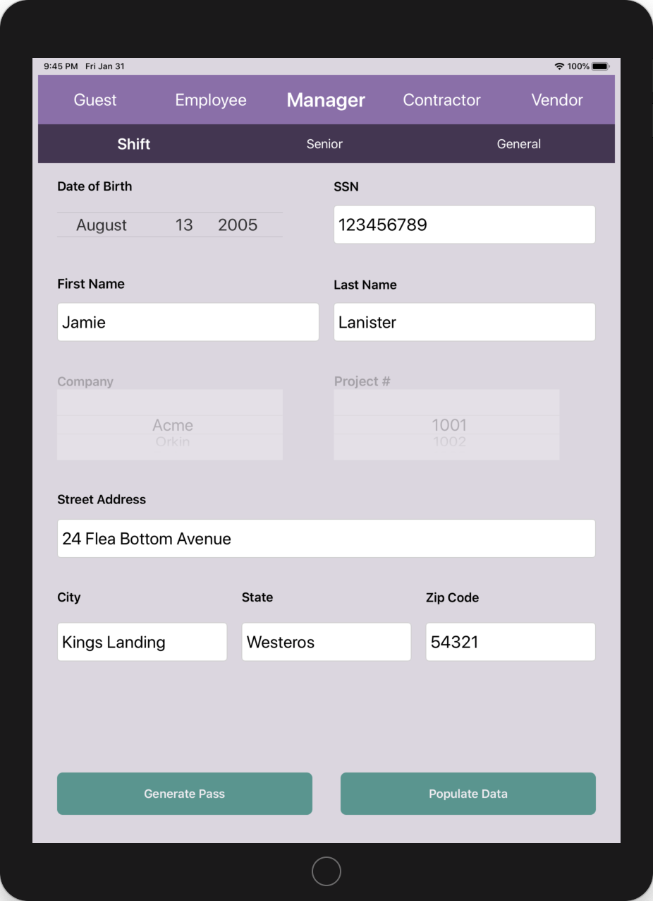
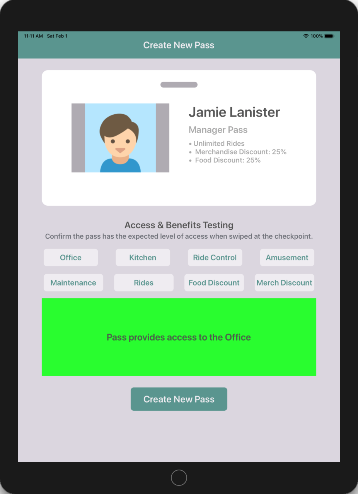
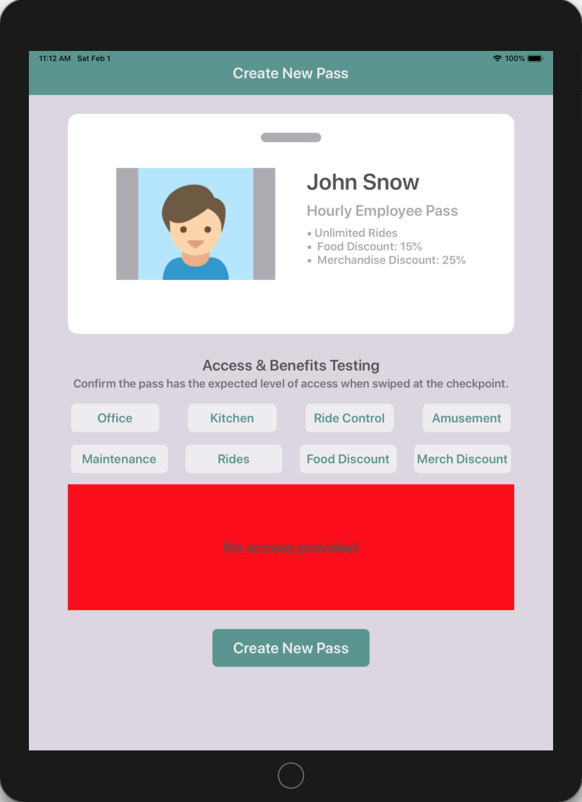

# Team Treehouse TechDegree Project 4

## Amusement Park Pass Generator: Part I

**App Description:**  Amusement Park Pass App for iPad. No UI for Part 1.  Translate business rules into custom objects and logic relating to various types of entrants and park pass privileges.

**Swift Features Used:**
Inheritance, Protocols, Protocol Composition, Enumerations, Optionals, Error Handling, Data Structures, Object Definitions, Logic, Polymorphism, Failable Initializers 

**Screenshots:**

N/A

# Team Treehouse TechDegree Project 5

## Amusement Park Pass Generator: Part II

**App Description:**  Amusement Park Pass App for iPad – UI Implementation.  User selects an entrant type, populates detailed entrant data, generates an amusement park pass and tests it for park area access and discounts.

**Swift Features Used:**
Autolayout, Picker Views, Refactoring, Input Validation, Extensions, Keyboard Control (UITextFieldDelegate), Segues, Sub-classing

**Screenshots:**

